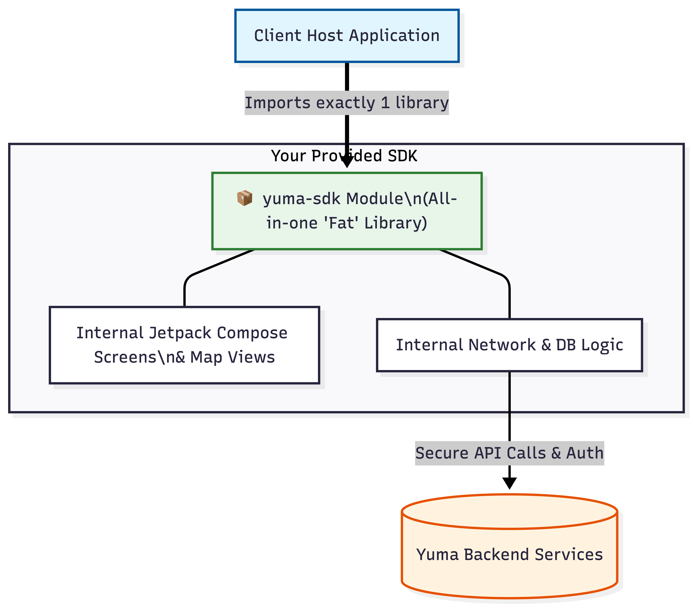
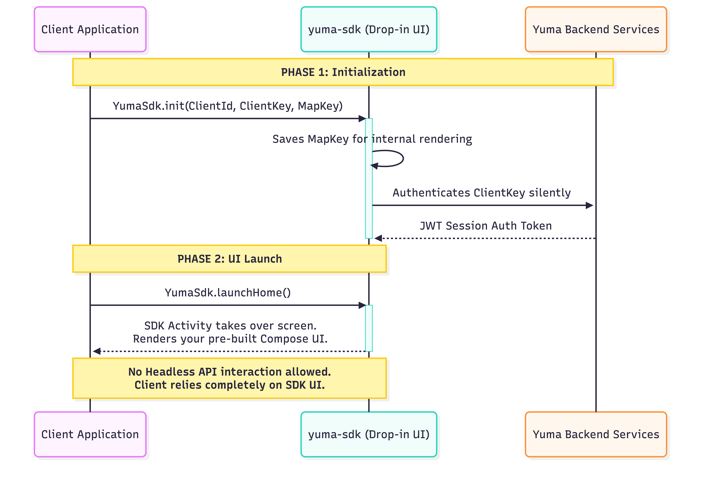

# Final SDK Architecture: Single Module (Drop-In UI Only)

Based on the decision to **not provide custom UI headless options** and to require a **Map Key** during initialization, this document details the locked-in architecture and specific integration flow for external clients.

---

## 1. High-Level Architecture Flow

The entire SDK (Networking, Authentication, Databases, Jetpack Compose UI, and Map renderings) is bundled into one singular `.aar` file. The client has no direct access to underlying headless APIs; they merely plug the module in and launch the UI.




## 2. Integration Sequence (Launch & Auth Flow)

Because the Custom UI / Headless option has been stripped out, integrating the SDK is completely linear and extremely simple for end-user developers.

### **The Initialization Logic**
During the host application's startup, the client must pass **four** required keys to configuration:
1. `ClientId`: Identifies the client partner.
2. `ClientSecret`: Secure key exchanged for the JWT Session Token.
3. `AuthCode`: Secure authorization code for silent authentication.
4. `MapKey`: Exposes the Google Maps API key (to be consumed internally by your Maps Compose UI).



## Abstracted Code Integration Example

What the client developer will actually write to start your SDK:

```kotlin
// Inside Client's Application Class
YumaSdk.init(
    context = this,
    sdkConfig = YumaSdkConfiguration.Builder()
        .setClientId(12345)
        .setClientSecret("YOUR_CLIENT_SECRET")
        .setAuthCode("YOUR_AUTH_CODE")
        .setMapApiKey("YOUR_GOOGLE_MAPS_API_KEY")
        .setEnvironment(Environment.PROD)
        .build()
)

// Later on a button press inside their app
binding.btnOpenMap.setOnClickListener {
    YumaSdk.launchSdk(this)
}
```
