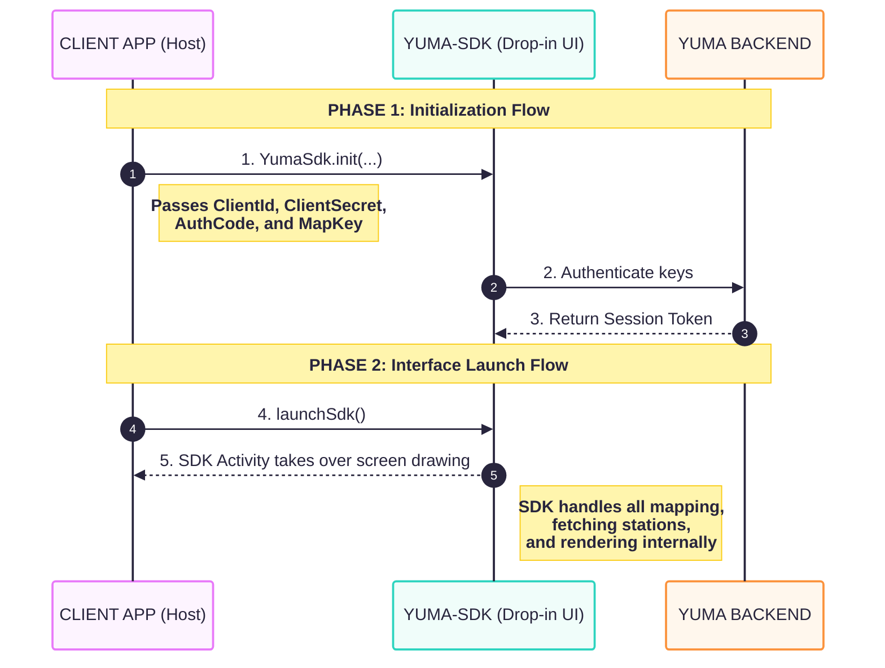

# Final SDK Architecture: Single Module (Visual Text)

Here is the Android Studio-friendly ASCII layout mapping out the locked-in Single Module SDK design. It specifically implements your rules of strictly enforcing the Drop-in UI and accepting the new `MapKey` configuration.

---

## 1. High-Level Architecture Flow

The entire SDK is encapsulated to ensure stability. No underlying components or headless data routes are exposed directly to the application; it just works out-of-the-box.

```text
 ┌────────────────────────────────────────────────────────┐
 │                Client Host Application                 │
 │             (Only allowed to use UI path)              │
 └────────────────────────────────────────────────────────┘
                              │
                    (Gradle compiles the .aar)
                              │
                              ▼
 ┌────────────────────────────────────────────────────────┐
 │                     yuma-sdk Module                    │
 │               (All-In-One "Drop-in" UI)                │
 ├────────────────────────────────────────────────────────┤
 │ ┌──────────────┐   ┌──────────────┐   ┌──────────────┐ │
 │ │   Network    │   │  Map Views   │   │ Pre-built UI │ │
 │ │   Auth Logic │   │ (Uses MapKey)│   │ (Compose)    │ │
 │ └──────────────┘   └──────────────┘   └──────────────┘ │
 └────────────────────────────────────────────────────────┘
                              │
                     (Internal API Calls)
                              │
                              ▼
 ┌────────────────────────────────────────────────────────┐
 │              Your Backend Services / DB                │
 └────────────────────────────────────────────────────────┘
```

---

## 2. Integration Sequence (Launch & Auth Flow)

Because the Custom UI option has been stripped out, the client's integration logic becomes completely foolproof and linear.

### **The Initialization Logic**
During initialization, they pass four core elements:
1. `ClientId`: Identifies the client to your backend.
2. `ClientSecret`: Secures the JWT token generation internally.
3. `AuthCode`: Secure authorization code for silent authentication.
4. `MapKey`: Used intrinsically by the maps framework deep inside your UI view trees.

```text
CLIENT APP (Host)                           YUMA-SDK (Drop-in UI)                     YUMA BACKEND
    │                                                  │                                  │
    │                                                  │                                  │
    │  PHASE 1: Initialization Flow                    │                                  │
    ├─── 1. YumaSdk.init(...)  ───────────────────────>│                                  │
    │      • ClientId, ClientSecret, AuthCode          ├─── 2. Authenticate keys ────────>│
    │      • MapKey (Stored for later)                 │                                  │
    │                                                  │<── 3. Return Session Token  ─────┤
    │                                                  │                                  │
    │                                                  │                                  │
    │  PHASE 2: Interface Launch Flow                  │                                  │
    ├─── 4. launchSdk() ──────────────────────────────>│ ┐                                │
    │                                                  │ │ (SDK handles all the           │
    │<── 5. SDK Activity takes over screen drawing ────┤ │  mapping, fetching stations,   │
    │       pre-built Jetpack UI screens               │ ┘  and rendering internally)     │
    │                                                  │                                  │
    │                                                  │                                  │
```

### Mermaid Visualization


