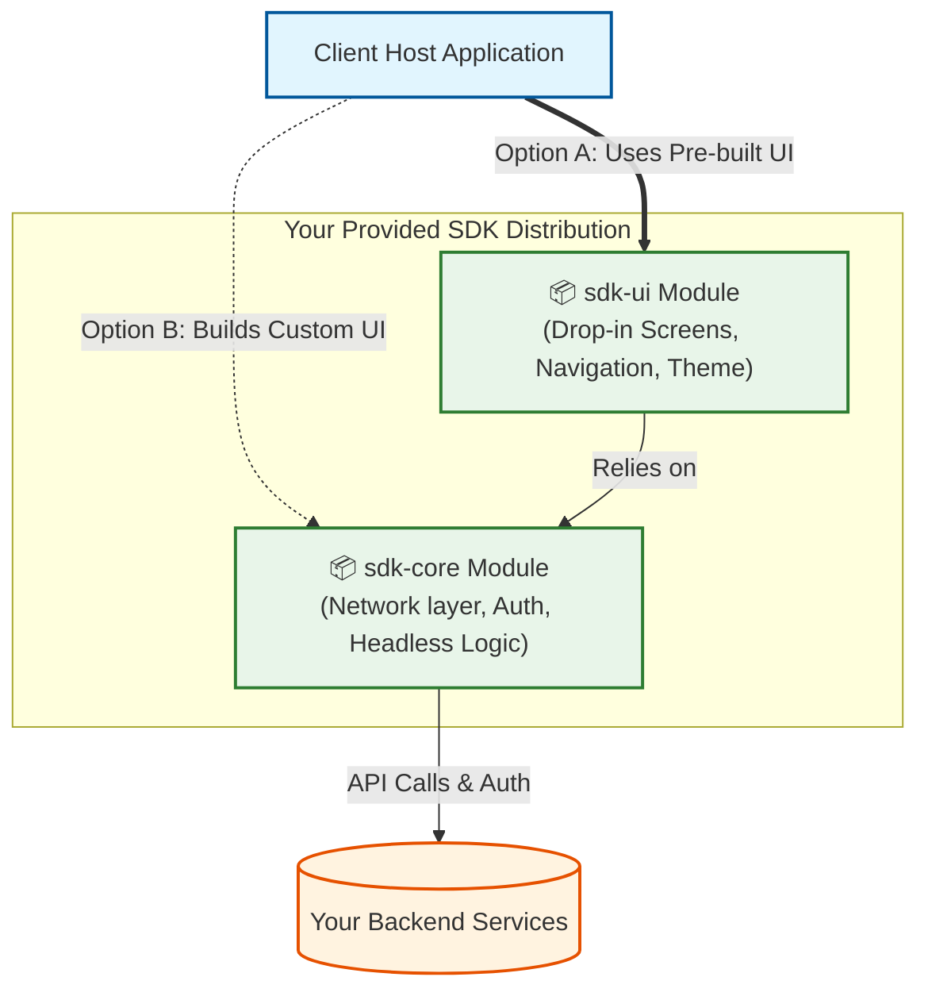
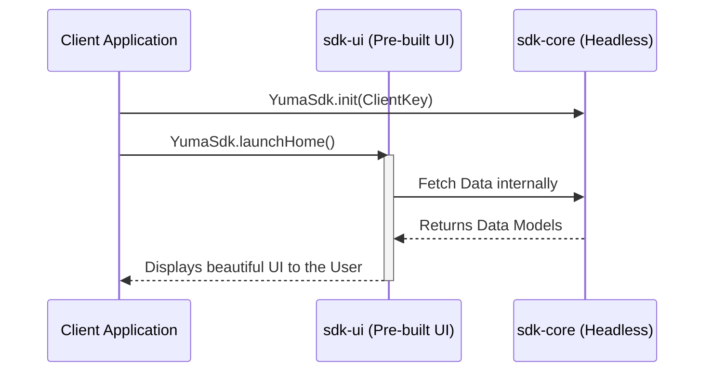
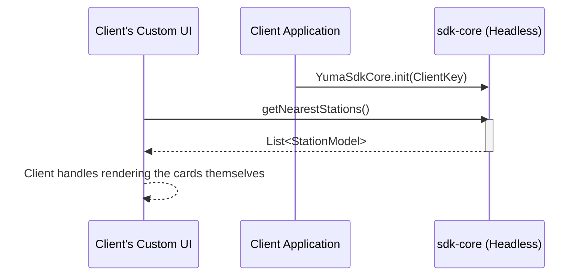

# SDK Architecture: The "Two Modules" Approach

This document outlines the architectural flow and use-cases for designing your SDK using the recommended two-module strategy (`sdk-core` and `sdk-ui`).

## High-Level Architecture
This diagram illustrates how the Client's Host Application connects to your SDK, and how your SDK communicates with your backend.

---

## SDK Integration Use Cases

Depending on the client's engineering capacity and desire for graphical control, they can choose between two distinct integration flows.

### Use Case A: The "Drop-In UI" Client (Plugin & Play)
* **Target Audience:** Clients who want to launch your product inside their app with zero design effort.
* **How it works:** The client adds the `sdk-ui` dependency to their Gradle script. Because `sdk-ui` depends on `sdk-core`, they automatically get both. They initialize the SDK and simply launch your pre-built Jetpack Compose Navigation Graph or Activity.
* **Implementation Effort for Client:** Minimum (1-2 Hours).

### Use Case B: The "Headless API" Client (Custom UI)
* **Target Audience:** Enterprise clients with strict brand guidelines who want your data but refuse to use third-party UI screens. 
* **How it works:** The client adds *only* the `sdk-core` dependency to their Gradle script (keeping their app size incredibly small). They build their own custom screens using their own colors/fonts, and wire their custom buttons to call your data APIs.
* **Implementation Effort for Client:** High (Several weeks to build their own UI wrapper).

## Why this is the "Sweet Spot"
By splitting into `sdk-core` and `sdk-ui`:
1. **You please everyone:** Fast startups use your `sdk-ui`, while giant enterprises build their own flow using `sdk-core`.
2. **Lean App Size:** If a client builds their own UI, they skip downloading your Jetpack Compose screens, avoiding a massive `.aar` file.
3. **No DI / Navigation conflicts:** Clients using pure headless logic won't be exposed to the internal Navigation frameworks used inside your `sdk-ui`.
